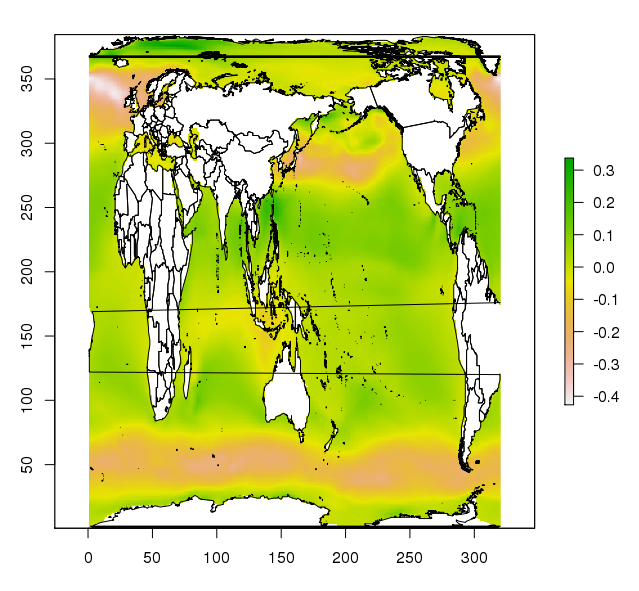

<!-- README.md is generated from README.Rmd. Please edit that file -->

```{r, echo = FALSE}
knitr::opts_chunk$set(
  collapse = TRUE,
  comment = "#>",
  fig.path = "README-"
)
```


# CMIP5files

browseables for CMIP5

Start here: https://github.com/mdsumner/nectar/wiki/Raijin-CMIP5

# CMIP5 files

These seem to cause a lot of grief, but NetCDF always does. 

SQLite DB built by Python code on /g/data, lists tokenized file paths. This is useful but needs to be run routinely so it's up to date, and really make a full path to all files. 

* list actual files, find best way to list (i.e. multiple find jobs?)
* scan each file and record metadata for each as per rancid::NetCDF or equivalent


# Dev Plan

* first pass only scan a sample of files, develop a scoping estimate of how long / how much etc. 
* Use try/catch defenses to be reliable, and feed back lessons into rancid package
* Build searchable table of files with DT/Shiny (can we publish this off Raijin?)
* Allow select file to deliver metadata DB as constellation of tables (or ncdump, whatevs)
* Identify common patterns across all files in variables, dimensions
* Use to develope use-case read code

```R
library(dplyr)
db <- src_sqlite("/g/data1/ua6/unofficial-ESG-replica/tmp/tree/cmip5_raijin_latest.db")
tab <- tbl(db, "cmip5")

id <- collect(filter(tab, model == "ACCESS1-3"))$id[10]
print(id)

library(rancid)
fs <- sample(list.files(id, full.names = TRUE), 1)

nc <- NetCDF(fs)

 nc$variable


Source: local data frame [6 x 16]

          name ndims natts   prec         units                  longname
         (chr) (int) (int)  (chr)         (chr)                     (chr)
1    time_bnds     2     0 double                               time_bnds
2          lat     2     4  float degrees_north       latitude coordinate
3          lon     2     4  float  degrees_east      longitude coordinate
4 lat_vertices     3     1  float degrees_north              lat_vertices
5 lon_vertices     3     1  float  degrees_east              lon_vertices
6          wfo     3    12  float    kg m-2 s-1 Water Flux into Sea Water
Variables not shown: group_index (int), storage (dbl), shuffle (lgl),
  compression (lgl), unlim (lgl), make_missing_value (lgl), missval (dbl),
  hasAddOffset (lgl), hasScaleFact (lgl), id (dbl)

tab <- collect(tab)
ss <- sample(nrow(tab), 100)
vv <- vector("list", length(ss))
system.time({
for (i in seq_along(vv)) {
fs <- sample(list.files(tab$id[i], full.names = TRUE, pattern = "nc$"), 1)
a <- try(NetCDF(fs))
if (!inherits(a, "try-error")) vv[[i]] <- a
}
})
#  user  system elapsed
#  3.203  69.720 113.174

object.size(vv)
# 4.88 Mb

any(unlist(lapply(vv, is.null)))
[1] FALSE

  save(vv, file = "~/cmip5_metadatasample.rda")
```
Etc. 

# Example

## 1. Use DT to get a user-useable path to a file. 

```R
download.file("http://climate-cms.unsw.wikispaces.net/file/view/cmip5_raijin.db/553966810/cmip5_raijin.db", 
              "data-raw/cmip5_raijin.db", mode = "wb")
library(dplyr)
cmip5_db <- src_sqlite("data-raw/cmip5_raijin.db")
cmip5 <- tbl(cm5, "cmip5")
library(DT)


d <- collect(cmip5) 
d <- d[, c(setdiff(names(d), "id"), "id")]
datatable(d, class = 'cell-border stripe', filter = 'top', options = list(
  pageLength = 35, autoWidth = TRUE
))
```

## 2. Convert mapped data to model space and make a map

```R
# module load         proj/4.9.0  netcdf/4.3.3.1p  
dp <- "/g/data/ua6/unofficial-ESG-replica/tmp/tree/tds.ucar.edu/thredds/fileServer/datazone/cmip5_data/cmip5/output1/NCAR/CCSM4/rcp85/mon/ocean/Omon/r6i1p1/v20140820/tauuo"
library(raster)
f <- list.files(dp, full.names = TRUE)
library(rancid)
library(angstroms)
nc <- NetCDF(f)

print(nc$variable)
lonlat <- romscoords(f, c("lon", "lat"))
library(maptools)
data(wrld_simpl)
plot(raster(f, varname = "tauuo"))
plot(romsmap(wrld_simpl, lonlat), add = TRUE)
#install.packages(c("rworldmap", "rworldxtra"))


tt <- spbabel::sptable(wrld_simpl)
tt$x_[tt$x_ < 0] <- tt$x_[tt$x_ < 0] + 360
w <- spbabel::sp(tt)
plot(raster(f, varname = "tauuo"))
plot(romsmap(w, lonlat), add = TRUE)
```

